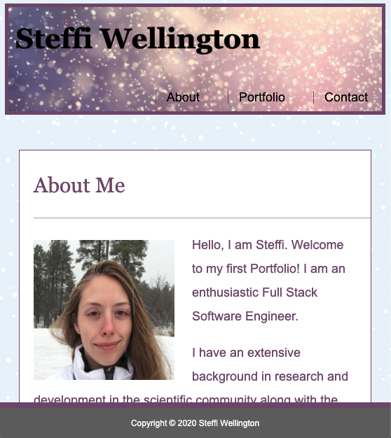

# Steffi Wellington Responsive-portfolio

### Overview
This is a Responsive-Portfolio utilizing HTML5, CSS, and media queries. 

### Who is this for?
Anyone looking to learn to build out a portfolio with just HTML5, CSS, and media queries this is a good practice and a fun way to display all of your projects. Build a portfolio from scratch! Take a look at mine for inspiration! 

### How do I use this myself?
You can use this yourself by first copying the code and using git clone in your terminal or your command prompt and then to see the finished product you can go ahead and open this code in Visual Studio code and right click on the index.html to open this in browser. Take a look at the Portfolio code. The real challenge is when you close out of my code and try to recreate it yourself from scratch! You can do this!

# Here is a picture of the Portfolio if you just want to take a gander at the picture and not look at the code down on your machine. You can also take a look at this code without using git clone by clicking through the files in this repo. Enjoy!
